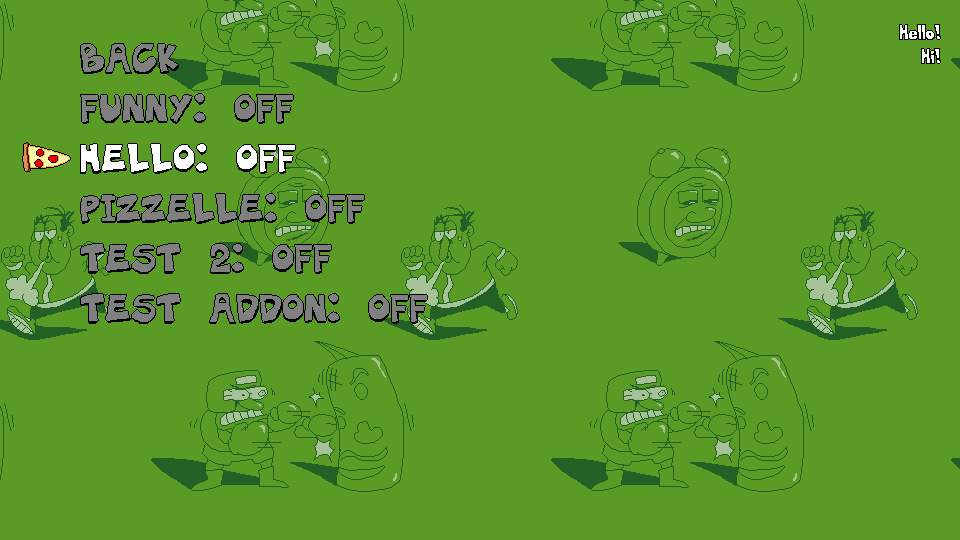
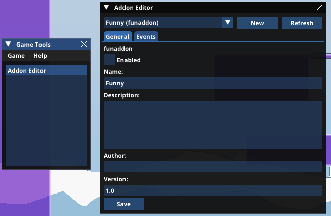

# Addon System

The addon system in Spicy Topping allows you to add extra functionality into the mod using so-called "addons". With it, you can add new objects, or even characters without too much effort.

Addons are loaded from an "addons" folder, located in Spicy Topping's AppData directory (%appdata%\PizzaTower_SE\addons). Each addon has its own separate folder.

Currently, it is incredibly incomplete, and doesn't have too much functionality at the moment. As such, everything here is subject to change.

There are two ways to enable/disable addons:

* Manage Addons Menu

The "Manage Addons" menu is accessible from the options and lets you toggle addons on or off. Pretty self explanatory.

* Addon Editor

The addon editor is an in-game tool that lets you change some aspects of addons and also quickly enable them without going into the options menu.

To access it, open the debug console and type in `showgametools`. This opens up the "Game Tools" window, which should have the Addon Editor. From there you can select an addon and then check "Enabled" to enable the addon.

