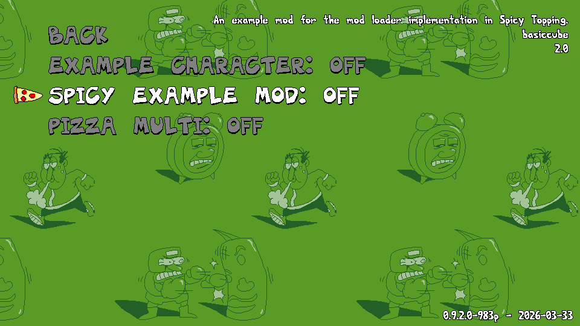

## Important Note

The mod loader, since May 2026, has been removed from the mod. The main reason is due to me simply not liking absolutely everything about it and wanting to redo it in a much better and cleaner way. It's replacement is the new, and, at the time of writing this, very incomplete and not yet ready **addon system**. The addon system is meant to have the same functionality as the mod loader but done better and hopefully will have more features than it in the near future.

Lastly, calling them addons is also less dumb than calling them mods or mini-mods.

## Introduction

This is the documentation for the mod loader in Spicy Topping. The mod loader allows you to add additional functionality to Spicy Topping, via "mods" or, for the sake of not confusing with the Spicy Topping mod itself, "mini-mods".  
Because the mod loader itself is currently quite unfinished and in a pretty barebones state, all information here is subject to change.

**This mod loader is not for Pizza Oven or xdelta patch mods. Those will not work and cannot in any way ever work.**

Mods are loaded from a "mods" folder, which can be either created next to where the game executable is, or in the mod's AppData directory. Each sub-folder in it is a separate mod.  
Once you put a mod in that folder, you can then go into the mod manager menu in-game and enable it.

## Current Status

As mentioned in the introduction, the mod loader in its current state, is still quite unfinished.  

Right now only two types of mods are supported, those being mods that add additional objects into the mod, and character reskin mods.  
There are also currently only a few safe-guards that should prevent mods from doing something nefarious to the game, and for character reskin mods, not all sprites can be replaced.

## Other Notes

Example mods that work with the mod loader can be found here:  
https://mega.nz/file/a3wmXLCI#OiJ1zZxRsWUNNH754kcAQRZVuSEa0_zWopqG9gHOyxI

If you intend to make something that isn't just a character reskin mod, you're obviously going to need to have some knowledge of GML and how it works.  
If you want to add new options into the mod configuration menu, sorry, but you're on your own there, as currently that is not something I intend on adding support for.